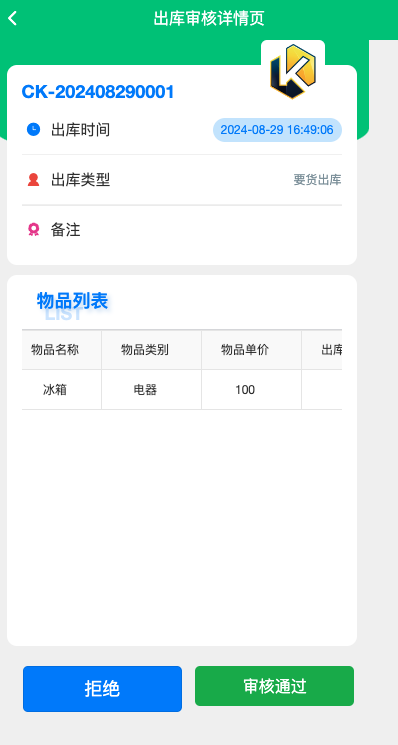

# 📖 其他开源毕设
- [心理测评管理系统](https://github.com/wanManage/psy_user)

# 仓储库存管理信息系统设计与实现

## 介绍
仓储库存管理信息系统基于springboot以及vue开发的前端分离的项目。 
该系统分为web端以及app端,web端使用 RuoYi框架进行二次开发；app端代码使用uniapp开发。可用做仓库管理系统、仓储管理系统、云仓库等毕业设计

## 技术栈
- 后端：springboot、mybits
- 前端：vue、element-ui、uniapp
- 数据库：mysql
- 开发工具：idea、vscode、maven、npm

## web端功能
##### 1. 基础数据

1. 门店信息：门店信息的增删改查
2. 物品信息：维护物料基础信息，支持设置最大库存，最小库存，物品图片等信息
3. 物料分类：支持按照层级结构维护物品的分类信息
4. 仓库信息：维护仓储基础信息，仓库分为总仓以及部门分仓，由各自部门管理员进行管理审核。
5. 供应商库：供应商基础信息维护
6. 客户信息：客户基础信息维护

##### 2. 入库管理
入库单管理：支持入库单新增，打印、审核，入库等功能。

##### 3. 出库管理
1. 出库单管理：支持出库单新增，打印。出库单支持审核等功能

##### 4. 调拨管理
1. 调拨单管理：创建物品调拨单据，从一个仓库调拨到另外一个仓库，向出库仓库生成出库单，待出库完成后，向入库仓库生成入库单。

##### 5. 要货管理
1. 要货单管理：可以向指定仓库生成要货单，对应仓库审批通过并完成出库以后，要货仓库生成入库单。

##### 6. 报表查询
1. 库存查询：支持按照仓库，入库单价显示仓库物品库存，支持Excel导出
2. 物品溯源：支持按照溯源码，物品编码，名称查询物品溯源信息，追踪物品从入库，出库到使用的全流程记录
3. 入库单、出库单、调拨单、要货单：对这几种单据进行查询，以及打印。

##### 7. 系统管. 
1. 用户管理：管理系统用户信息
2. 角色管理：管理角色信息
3. 菜单管理：管理系统菜单
4. 部门管理：管理系统部门信息
5. 岗位管理：管理系统岗位信息
6. 字典管理：通过设置字典控制web端页面的展示效果
7. 参数管理：通过参数管理控制系统一些参数项
8. 日志管理：查看系统操作日志以及登陆日志

##### 8. 系统监控
1. 在线用户:统计当前在线用户，显示相关信息，以及进行强退操作。
2. 服务监控:监控服务所运行的服务器cpu、内存、硬盘以及服务相关信息。
3. 缓存监控:监控redis缓存情况。
4. 缓存列表:查看redis中缓存的信息，并对其进行管理。

## app端功能

##### 1. 首页
1. 展示当前用户没处理的信息

##### 2. 工作台
1. 入库审核:审核入库单据。
2. 出库审核:审核出库单据。
3. 入库扫码:对已经审核通过的入货物品进行扫码登记，进行入库操作。
4. 出库审核:对已经审核通过的出货物品进行扫码登记，进行出库操作。
5. 要货管理:对要货单进行审批。
6. 库存查询：查询仓库中物品的库存情况。

##### 3. 我的
1. 仓库信息
2. 修改密码
3. 退出登陆

## 程序

## 演示图

<table>
    <tr>
        <td></td>
        <td></td>
    </tr>
</table>

<table>
    <tr>
        <td></td>
        <td></td>
    </tr>
</table>

<table>
    <tr>
        <td></td>
        <td></td>
    </tr>
</table>

<table>
    <tr>
        <td></td>
        <td></td>
    </tr>
</table>

<table>
    <tr>
        <td></td>
        <td></td>
    </tr>
</table>

<table>
    <tr>
        <td></td>
        <td></td>
    </tr>
</table>

<table>
    <tr>
        <td></td>
        <td></td>
    </tr>
</table>

<table>
    <tr>
        <td></td>
        <td></td>
    </tr>
</table>

<table>
    <tr>
        <td></td>
        <td></td>
    </tr>
</table>

<table>
    <tr>
        <td></td>
        <td></td>
    </tr>
</table>

<table>
    <tr>
        <td></td>
        <td></td>
    </tr>
</table>

## 联系我

<b>wx：Yaoxiu121：</b> 

